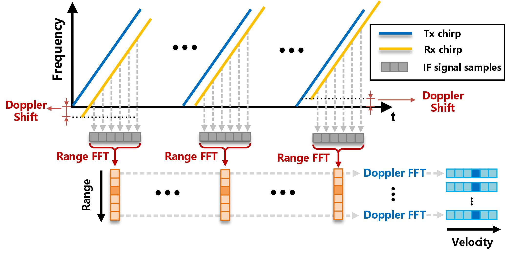
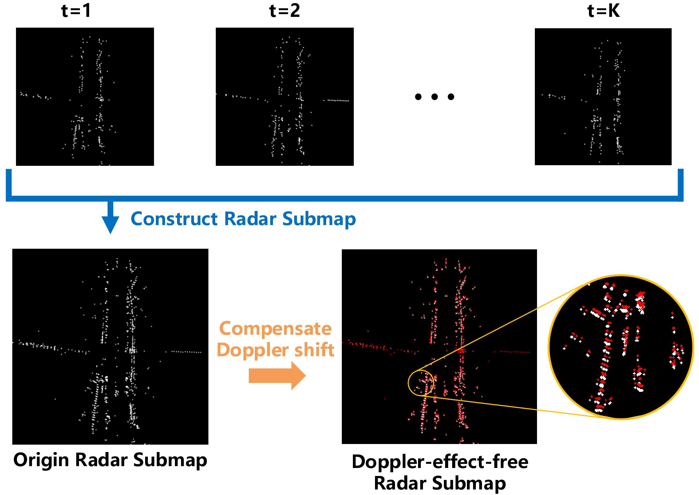
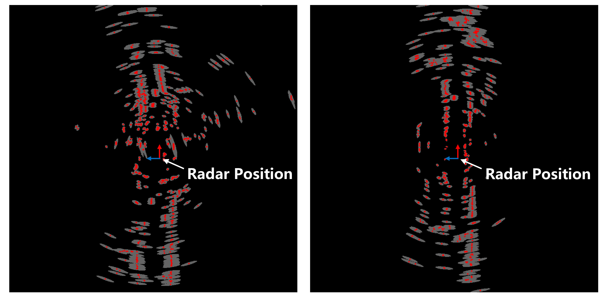
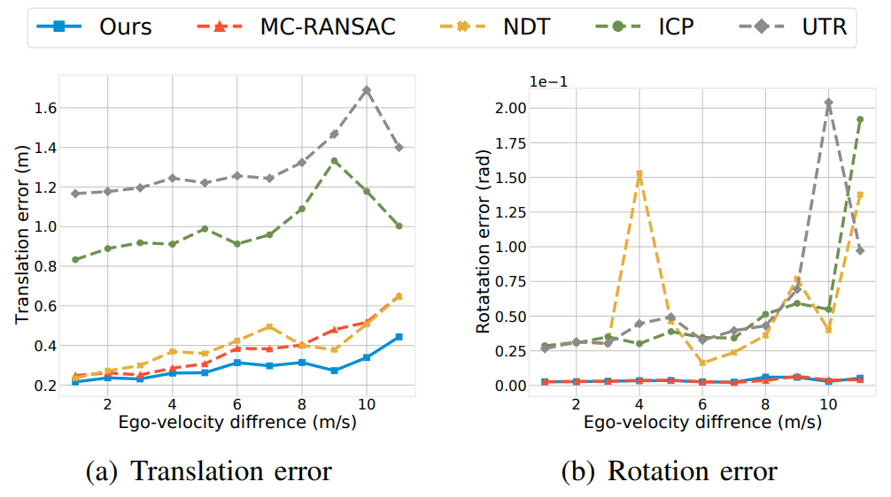

            <a href="https://qqqGpe.github.io/">Pengen Gao,&nbsp;&nbsp;&nbsp; </a>
            <a href="http://www.sheng-kai.top/">Shengkai Zhang,&nbsp;&nbsp;&nbsp; </a>
            <a href="http://eic.hust.edu.cn/professor/wangwei/index.html">Wei Wang,&nbsp;&nbsp;&nbsp; </a>
            <a href="https://christopherlu.github.io/">Chris Xiaoxuan Lu</a>

 

 
    <a href="https://arxiv.org/pdf/2112.14887.pdf">Paper </a> &nbsp;&nbsp;&nbsp;&nbsp;&nbsp;&nbsp;
    <a href="https://github.com/qqqGpe/DCRML">Code </a> &nbsp;&nbsp;&nbsp;&nbsp;&nbsp;&nbsp;
    <a href="https://www.youtube.com/watch?v=DUsr0B203ZQ&t=78s">Video </a>

 

Abstract

<!-- 
 #Abstract 
 -->
Automotive mmWave radar has been widely used in the automotive industry due to its small size, low cost, and complementary advantages to optical sensors (cameras, LiDAR, etc.) in adverse weathers, e.g., fog, raining, and snowing. On the other side, its large wavelength also poses fundamental challenges to perceive the environment. Recent advances have made breakthroughs on its inherent drawbacks, i.e., the multipath reflection and the sparsity of mmWave radar's point clouds. However, the lower frequency of mmWave signals is more sensitive to vehicles' mobility than that of the visual and laser signals. This work focuses on the problem of frequency shift, i.e., the Doppler effect distorts the radar ranging measurements and its knock-on effect on metric localization. We propose a new radar-based metric localization framework that obtains more accurate location estimation by restoring the Doppler distortion. Specifically, we first design a new algorithm that explicitly compensates the Doppler distortion of radar scans and then model the measurement uncertainty of the Doppler-compensated point cloud to further optimize the metric localization. Extensive experiments using the public nuScenes dataset and Carla simulator demonstrate that our method outperforms the state-of-the-art approach by 19.2% and 13.5% improvements in terms of translation and rotation errors, respectively.

 

Vedio (3min)

<iframe width="840" height="473" src="https://www.youtube.com/embed/DUsr0B203ZQ" title="YouTube video player" frameborder="0" allow="accelerometer; autoplay; clipboard-write; encrypted-media; gyroscope; picture-in-picture" allowfullscreen></iframe>

 

Methods

 

    
    

        <h2>Doppler effect in radar measurement</h2>
        
&nbsp;&nbsp;&nbsp;&nbsp;FMCW radars works well when a vehicle’s ego-velocity is low. However, for autonomous driving scenarios where the ego-velocity changes dramatically from time to time, the Doppler shift on the spectrum will incur a non-negligible knock-on effect on the range measurements. As shown in the left figure, the Doppler effect causes an apparent frequency shift on the FMCW signal, which eventually results in the Doppler distortion to the point cloud from a radar scan. Such a distortion is significantly degrading the performance of metric localization.

    

 

    
    

        <h2>Doppler distortion compensation</h2>
        
&nbsp;&nbsp;&nbsp;&nbsp;We notice that the Doppler effect can only shift the frequency peaks rather than their phases. And the phases are essential to estimate the radial velocity. Based on such an observation, we elaborate on the Doppler shift compensation method in our work. Please refer to our paper for detail.

        
&nbsp;&nbsp;&nbsp;&nbsp;Left figure illustrates the pipeline of constructing a Doppler-effect-free radar submap, where red points are radar targets after compensation.

    

 

    
    

        <h2>Uncertainty estimation</h2>
        
&nbsp;&nbsp;&nbsp;&nbsp;Uncertainty estimation plays an important role in point cloud registration. In our work we model the uncertainty of each radar target, and take the uncertainty into an optimatization framework to find the best metric localization with minimum matching residuals.

        
&nbsp;&nbsp;&nbsp;&nbsp;The gray ellipse area around each target represents for the uncertainty of radar measurement. Those points further away from the sensor have larger uncertainties, and out system will punish these uncertainty points by taking the Mahalanobis norm to be parts of the optimization objective.

    

 

    
    

        <h2>Performance</h2>
        
&nbsp;&nbsp;&nbsp;&nbsp;We evaluate our system on <a href="https://www.nuscenes.org/">Nuscenes dataset</a> and <a href="https://carla.org/">Carla simulator</a>. Comparing with conventional and state-of-the-art radar metric localization algorithms, our method achieves the best performance in terms of translation and rotation estimation. Specifically, DC-Loc can outperforms MC-RANSAC (state-of-the-art) by 25.2% translation error and 5.6% rotation error, respectively.

    

